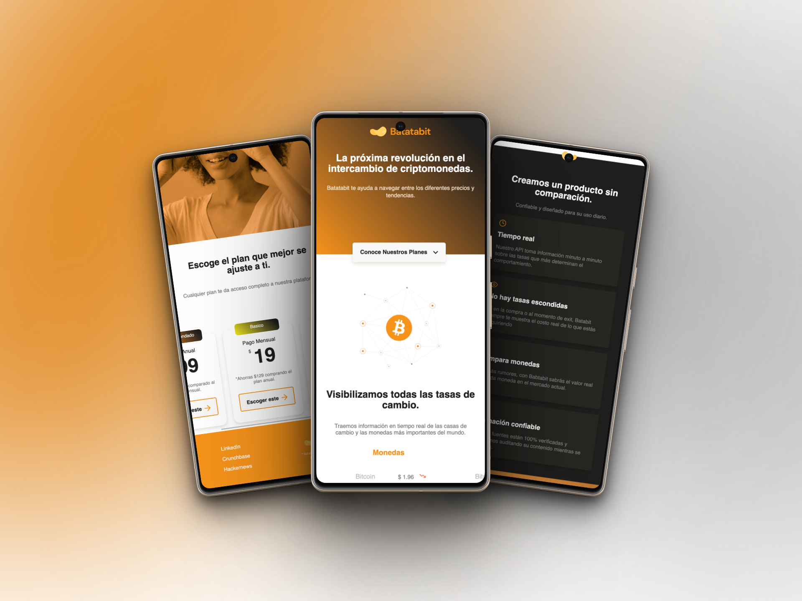

Cer
# Batatabit - Your Cryptocurrency Exchange Platform

Welcome to Batatabit! We are the next revolution in the world of cryptocurrency exchange. Our platform provides you with real-time information on currency exchange rates and fees at the world's major exchanges.

## Key Features

- **Real-Time Information**: Our API delivers minute-by-minute data on the rates that most influence the market.

- **No Hidden Fees**: At Batatabit, we always show you the real cost of your acquisitions, with no unpleasant surprises.

- **Currency Comparison**: Forget rumors; with Batatabit, you get the real value of each currency in the current market.

- **Reliable Information**: Our sources are 100% verified, and we continue to audit their content in real time.

## Screenshots

Here are some previews of our platform:

## Pricing and Plans

Choose the plan that best suits your needs:

- **Annual Payment**: $99 per year (*Save $129 compared to the monthly plan*).

- **Monthly Payment**: $19 per month.

- **Limited Offer**: $60 for six months (*Save $54 compared to the monthly plan*).

## Contact

For more information, feel free to get in touch with us:

- LinkedIn: [Juan Diego Molano](https://www.linkedin.com/in/juandmolanof/)
- Website: [www.mobile-layout.netlify.app](https://mobile-layout.netlify.app/)

Join Batatabit and start making informed decisions in the cryptocurrency exchange world!

---
